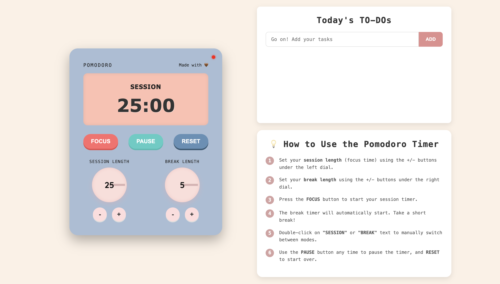

# 🎵 Pomopop – A Pomodoro Timer with To-Do List 📻💖

**Pomopop** is a stylish Pomodoro timer with a built-in to-do list, designed with a retro radio aesthetic and a pink-themed UI. Stay focused, manage tasks efficiently, and work in productive intervals with this visually appealing productivity tool!

## ✨ Features
- Pomodoro Timer: Set and control your work and break sessions.
- To-Do List: Add, track, and manage your daily tasks.
- Retro Radio UI: A nostalgic, playful interface with soft pink hues.
- Custom Session Lengths: Adjust focus and break times with dials.
- Pause & Reset Options: Stay in control of your workflow.

## 📸 Preview

## 🚀 How to Use
- Set Focus & Break Time - Adjust the session duration using the dials.
- Start a Pomodoro - Click the FOCUS button to begin.
- Break Reminder - The timer switches automatically to break mode.
- Pause or Reset - Click PAUSE anytime or RESET to restart.
- Manage To-Dos - Add tasks in the "Today's TO-DOs" section.

Inspired by the Pomodoro technique and retro radio designs 🤎